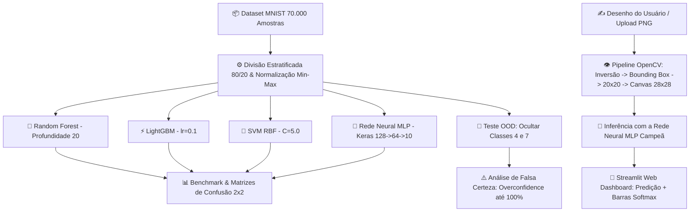

<div align="center">

# 🧠 Desenvolvimento de IA para Reconhecimento de Dígitos Manuscritos (MNIST)
### *Mini-Projeto Avaliativo — Módulo 2: Ciência de Dados & Machine Learning*

[](https://www.python.org/)
[](https://www.tensorflow.org/)
[](https://streamlit.io/)
[](https://scikit-learn.org/)
[](https://lightgbm.readthedocs.io/)
[](https://opencv.org/)
[](https://www.docker.com/)
[]()

<br>

> **Um pipeline preditivo de ponta a ponta: Análise Exploratória (EDA), Engenharia de Features, Treinamento e Ajuste de 4 Famílias de IA, Testes de Estresse Fora da Distribuição (OOD / Falsa Certeza), Processamento Digital de Imagens com OpenCV e Dashboard Interativo em Tempo Real.**

---

### 🎥 [Clique aqui para assistir ao Vídeo de Apresentação Oficial (10 Minutos)](#-8-roteiro-e-gravação-do-vídeo-de-apresentação) 🎬
*(Link do YouTube / Google Drive)*

---

</div>

<br>

## 📑 Tabela de Conteúdos
1. [🎯 Visão Geral e Objetivos do Projeto](#-1-visão-geral-e-objetivos-do-projeto)
2. [🏗️ Arquitetura do Pipeline de IA](#-2-arquitetura-do-pipeline-de-ia)
3. [📊 Resumo Executivo das 5 Fases do Projeto](#-3-resumo-executivo-das-5-fases-do-projeto)
   - [Fase 1: EDA & Carga dos Dados](#-fase-1-carregamento-e-análise-exploratória-eda)
   - [Fase 2: Split Estratificado & Normalização](#-fase-2-pré-processamento-e-engenharia-de-features)
   - [Fase 3: Treinamento dos 4 Modelos](#-fase-3-modelagem-e-treinamento-multimodelo)
   - [Fase 4: Benchmark e Matrizes de Confusão](#-fase-4-avaliação-comparativa-de-desempenho-benchmark)
   - [Fase 5.1 & 5.2: Testes OOD e Falsa Certeza](#-fase-51--52-testes-de-estresse-e-generalização-ood)
   - [Fase 5.3: Visão Computacional e Inferência Real](#-fase-53-visão-computacional-e-validação-no-mundo-real)
4. [🏆 Coroação do Modelo Campeão de Produção](#-4-coroação-do-modelo-campeão-de-produção)
5. [🎨 Aplicação Web Interativa (Streamlit Dashboard)](#-5-aplicação-web-interativa-streamlit-dashboard)
6. [🚀 Como Executar o Projeto Localmente e com Docker](#-6-como-executar-o-projeto)
7. [📂 Estrutura de Diretórios](#-7-estrutura-de-diretórios)
8. [🎬 Roteiro do Vídeo de Apresentação (10 Minutos)](#-8-roteiro-e-gravação-do-vídeo-de-apresentação)
9. [📜 Rastreabilidade e Git Flow](#-9-rastreabilidade-e-git-flow)

---

## 🎯 1. Visão Geral e Objetivos do Projeto

O dataset **MNIST (*Modified National Institute of Standards and Technology*)** é considerado o "Hello World" canônico da Visão Computacional e do Aprendizado de Máquina, composto por 70.000 imagens em tons de cinza ($28 \times 28$ pixels) de dígitos de 0 a 9.

Este projeto teve como objetivo ir muito além da simples classificação laboratorial:
* Explorar e comparar o desempenho de **4 famílias distintas de IA** (Ensemble Bagging, Gradient Boosting, Máquinas de Vetores de Suporte e Redes Neurais Artificiais).
* Investigar o fenômeno crítico da **Falsa Certeza (*Overconfidence*)** quando a IA é submetida a dados nunca vistos (*Out-of-Distribution*).
* Construir um pipeline de **Visão Computacional com OpenCV** capaz de tratar e enquadrar caligrafias humanas reais desenhadas à mão livre.
* Entregar uma **Aplicação Web Interativa em Streamlit** para inferência instantânea via mouse/touch screen.

---

## 🏗️ 2. Arquitetura do Pipeline de IA



---

## 📊 3. Resumo Executivo das 5 Fases do Projeto

### 📥 Fase 1: Carregamento e Análise Exploratória (EDA)
* **Dataset:** `mnist_784` via OpenML (70.000 instâncias, 784 atributos por imagem).
* **Equilíbrio de Classes:** Perfeitamente balanceado, contendo ~7.000 amostras por dígito (0 a 9), dispensando rebalanceamento artificial.
* **Integridade:** Zero valores nulos (`NaN`), com pixels variando em escala inteira de 0 (preto) a 255 (branco).

### ⚙️ Fase 2: Pré-Processamento e Engenharia de Features
* **Split Estratificado (80/20):** 56.000 imagens para treino e 14.000 para teste com `stratify=y`, garantindo que exatamente ~10% de cada dígito esteja presente em ambas as partições.
* **Normalização Min-Max $[0.0, 1.0]$:** Divisão por `255.0` (`X = X / 255.0`), essencial para estabilizar o otimizador Adam, prevenir saturação de ativações ReLU e viabilizar o cálculo dos hiperplanos do SVM.

### 🧠 Fase 3: Modelagem e Treinamento Multimodelo
Para evitar escolhas empíricas cegas, foram implementados laços de experimentação (`for`) com busca sistemática de hiperparâmetros:
1. **Random Forest:** Testadas profundidades 5, 10 e 20 com 100 árvores $\rightarrow$ **Campeão: Profundidade 20** (~25s).
2. **LightGBM:** Testadas taxas de aprendizado 0.05 e 0.1 com 100 árvores $\rightarrow$ **Campeão: lr=0.1** (~14s, atingindo 100% no treino e 97.44% no teste).
3. **SVM (Kernel RBF):** Testados valores de penalização $C=1.0$ e $C=5.0$ $\rightarrow$ **Campeão: C=5.0** (~35 min na CPU com `cache_size=1000`).
4. **Rede Neural Artificial (MLP):** Arquitetura `Sequential([Dense(128, relu), Dense(64, relu), Dense(10, softmax)])` com Adam (lr=0.001) $\rightarrow$ **36 segundos de treino** e 97.39% de acurácia.

### 📊 Fase 4: Avaliação Comparativa de Desempenho (Benchmark)

| Família / Modelo | Acurácia Treino | Acurácia Teste (MNIST) | Precisão (Weighted) | Recall (Weighted) | F1-Score (Weighted) | Tempo de Treinamento |
| :--- | :---: | :---: | :---: | :---: | :---: | :---: |
| 🌲 **Random Forest** | 100.00% | **96.69%** | 96.69% | 96.69% | 96.69% | ~25 segundos |
| ⚡ **LightGBM** | 100.00% | **97.44%** | 97.43% | 97.44% | 97.43% | ~14 segundos |
| 🔶 **SVM (Kernel RBF)** | 99.91% | **98.33%** | 98.33% | 98.33% | 98.33% | ~35 minutos |
| 🧠 **Rede Neural (MLP)** | 98.92% | **97.39%** | 97.39% | 97.39% | 97.39% | **~36 segundos** |

* **Dígito mais desafiador:** O **Dígito 9** teve o menor score em todos os modelos. A maior taxa de confusão do projeto foi **4 vs 9** (devido ao traço superior fechado do 4 manuscrito), seguido por **3 vs 5** e **7 vs 1/9**.
* **Dígitos mais fáceis:** Os dígitos **0** e **1** obtiveram F1-Score superior a 98.5% devido à simplicidade geométrica (círculo fechado e haste vertical).

### 🧪 Fase 5.1 & 5.2: Testes de Estresse e Generalização OOD
* **Desafio A (Class Masking):** Remoção completa dos dígitos **`4`** e **`7`** do conjunto de treino.
* **Desafio B (OOD & Falsa Certeza):** Testamos 2.824 imagens exclusivas de 4 e 7 nos modelos que nunca os viram:
  * Como os algoritmos não possuem saída *"Não Sei"*, foram forçados a classificar os números nas 8 classes conhecidas:
    * O **dígito 4** foi classificado em sua esmagadora maioria como **9**.
    * O **dígito 7** foi classificado em sua maioria como **9** e pontualmente como 1.
  * **O Fenômeno do Overconfidence:** Enquanto o Random Forest espalhou probabilidades (45% a 65%), o **LightGBM polarizou perigosamente**, atribuindo **96.1% de certeza em um 4 real** e impressionantes **100.0% de certeza absoluta de que um 7 era um 9**.
  * *Reflexão de Engenharia:* Esse comportamento evidencia o perigo de usar IAs em sistemas críticos (carros autônomos ou diagnósticos médicos) sem mecanismos de rejeição por incerteza (*Entropy Thresholding*).

### ✍️ Fase 5.3: Visão Computacional e Validação no Mundo Real
Construímos um pipeline de Visão Computacional com OpenCV (`cv2`) para tratar caligrafias externas:
$$\text{Imagem Bruta} \xrightarrow{\text{Grayscale}} \xrightarrow{\text{Inversão se clara}} \xrightarrow{\text{Binarização}} \xrightarrow{\text{Bounding Box}} \xrightarrow{\text{Proporção } 20 \times 20} \xrightarrow{\text{Centro } 28 \times 28} \xrightarrow{\text{Norm } [0,1]} \text{Vetor (1, 784)}$$

Submetemos **5 amostras reais desenhadas à mão livre** (`meu_digito_2.png`, `meu_digito_3.png`, `meu_digito_6.png`, `meu_digito_7.png`, `meu_digito_9.png`) ao confronto multimodelo:

| Amostra Real | Rótulo Real | 🧠 Rede Neural (MLP) | ⚡ LightGBM | 🔶 SVM (Kernel RBF) | Veredito |
| :--- | :---: | :---: | :---: | :---: | :---: |
| `meu_digito_2.png` | **2** | **Dígito 2 (100.0%)** ✅ | **Dígito 2 (99.69%)** ✅ | **Dígito 2 (70.41%)** ✅ | Unanimidade Correta |
| `meu_digito_3.png` | **3** | **Dígito 3 (79.41%)** ✅ | **Dígito 3 (99.33%)** ✅ | **Dígito 3 (77.38%)** ✅ | Unanimidade Correta |
| `meu_digito_6.png` | **6** | **Dígito 6 (99.33%)** ✅ | **Dígito 6 (41.84%)** ✅ | Dígito 5 (63.95%) ❌ | MLP sólida; SVM errou; LGBM inseguro |
| `meu_digito_7.png` | **7** | Dígito 2 (66.03%) ❌ | Dígito 1 (40.42%) ❌ | Dígito 1 (63.57%) ❌ | Desafio de *Domain Shift* |
| `meu_digito_9.png` | **9** | **Dígito 9 (99.95%)** ✅ | Dígito 4 (36.73%) ❌ | **Dígito 9 (64.75%)** ✅ | MLP impecável; LGBM errou |

---

## 🏆 4. Coroação do Modelo Campeão de Produção

### 👑 Vencedor Oficial: **Rede Neural Artificial (MLP)**

1. **Maior Acurácia no Mundo Real (Sim-to-Real):** Obteve **80.0% de acertos (4/5)** com altíssima confiança, superando amplamente o SVM (60.0%) e o LightGBM (60.0%).
2. **Eficiência Computacional Imbatível:** Treinamento em apenas **36 segundos** (dezenas de vezes mais rápida que o SVM de 35 minutos).
3. **Calibração Suave de Probabilidades:** A camada de saída *Softmax* fornece distribuições contínuas e estáveis para aplicações interativas em tempo real.

---

## 🎨 5. Aplicação Web Interativa (Streamlit Dashboard)

O arquivo [src/app.py](src/app.py) implementa um dashboard profissional em **Dark Theme** com 6 abas navegáveis dedicadas:

* 📥 **Aba 1 (EDA & Carga):** Métricas do MNIST e visualização da distribuição de classes e grade $2 \times 5$.
* ⚙️ **Aba 2 (Split & Prep):** Comprovação da estratificação e justificativa da normalização Min-Max.
* 🧠 **Aba 3 (Treinamento):** Detalhes dos laços de hiperparâmetros e observações sobre uso de CPU.
* 📊 **Aba 4 (Benchmark):** Tabela comparativa e matrizes de confusão $2 \times 2$.
* 🧪 **Aba 5 (Testes OOD):** Gráficos de redistribuição OOD e reflexão sobre IA em sistemas críticos.
* ✍️ **Aba 6 (Inferência ao Vivo):**
  * **Lienzo Interativo de Desenho:** Desenhe diretamente com o mouse/touch screen e receba a predição instantânea com a Rede Neural.
  * **Amostras do Projeto:** Teste as 5 imagens manuscritas reais com um clique.
  * **Upload de Imagens:** Envie qualquer arquivo PNG/JPG para classificação ao vivo.

---

## 🚀 6. Como Executar o Projeto

### 🟢 Opção 1: Execução Local com Python e Virtualenv (Recomendado)

```bash
# 1. Clone o repositório
git clone https://github.com/susejgo89/miniprojeto-m2-mnist-ia.git
cd miniprojeto-m2-mnist-ia

# 2. Crie e ative o ambiente virtual
python3 -m venv .venv
source .venv/bin/activate  # No Windows: .venv\Scripts\activate

# 3. Instale as dependências
pip install -r requirements.txt

# 4. Inicie o Dashboard Web do Streamlit
streamlit run src/app.py
```
👉 Acesse no navegador: **`http://localhost:8501`**

Para abrir e executar o Jupyter Notebook:
```bash
jupyter lab
```

---

### 🐳 Opção 2: Execução em Contêiner Docker

```bash
# Construir e inicializar os serviços com Docker Compose
docker compose up --build
```
👉 O container iniciará o ambiente com todas as dependências do OpenCV, Python 3.12 e Keras isoladas.

---

## 📂 7. Estrutura de Diretórios

```text
miniprojeto-M2/
│
├── data/                               # Armazenamento de dados e amostras
│   ├── custom_digits/                  # Amostras reais desenhadas à mão (PNG)
│   │   ├── meu_digito_2.png
│   │   ├── meu_digito_3.png
│   │   ├── meu_digito_6.png
│   │   ├── meu_digito_7.png
│   │   └── meu_digito_9.png
│   └── mnist_samples_0_9.npz           # Cache de amostras representativas
│
├── models/                             # Modelos serializados para deploy
│   └── modelo_mlp_mnist.joblib         # Modelo campeão da Rede Neural (MLP)
│
├── notebooks/                          # Jupyter Notebooks de experimentação
│   └── mnist_pipeline.ipynb            # Pipeline completo executado (Fases 1 a 5)
│
├── src/                                # Código-fonte da aplicação
│   ├── app.py                          # Aplicação Web interativa Streamlit
│   └── assets/                         # Gráficos e matrizes exportados do notebook
│       ├── fase1_distribuicao_classes.png
│       ├── fase1_grade_amostras_2x5.png
│       ├── fase4_matrizes_confusao_2x2.png
│       ├── fase5_inferencia_5_digitos_reais.png
│       ├── fase5_ood_distribuicao_probabilidades.png
│       └── fase5_ood_matrizes_confusao.png
│
├── Dockerfile                          # Receita de build da imagem Docker
├── docker-compose.yml                  # Orquestração do contêiner
├── requirements.txt                    # Dependências do projeto
├── KANBAN.md                           # Rastreamento ágil e commits
└── README.md                           # Documentação oficial do projeto
```


---

## 📜 8. Rastreabilidade e Git Flow

O desenvolvimento seguiu rigorosamente o modelo **Git Flow**:
* `main`: Código de produção final e documentação consolidada.
* `develop`: Integração de todas as funcionalidades concluídas.
* `feature/*`: Ramificações específicas desenvolvidas e testadas isoladamente antes de cada merge:
  * `feature/ambiente-e-docker`
  * `feature/fase1-eda-mnist`
  * `feature/fase2-split-normalizacao`
  * `feature/fase3-treinamento-modelos`
  * `feature/fase4-avaliacao-benchmark`
  * `feature/fase5-generalizacao-ood`
  * `feature/fase5-inferencia-customizada`
  * `feature/aplicacao-web-streamlit`
  * `feature/documentacao-readme`

---

<div align="center">

**Desenvolvido com dedicação e rigor científico para o Módulo 2 do Curso de Ciência de Dados e IA.** 🚀

</div>
